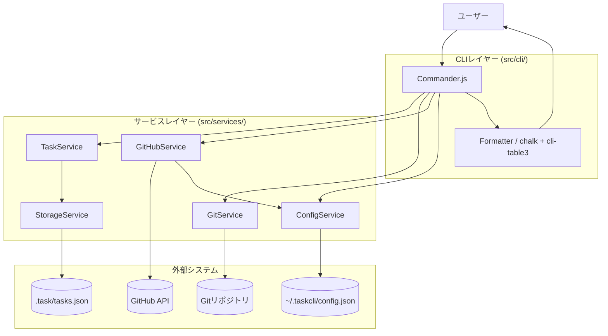

# 技術仕様書 (Architecture Design Document)

## テクノロジースタック

### 言語・ランタイム

| 技術 | バージョン | 選定理由 |
|------|-----------|----------|
| Node.js | v18以上（開発環境: v24.11.0） | 非同期I/O処理に優れ、CLIツールのランタイムとして広く普及。npm エコシステムが充実しており必要なライブラリの入手が容易 |
| TypeScript | `~5.3.0`（5.x 系、パッチのみ自動更新） | 静的型付けによりコンパイル時にバグを検出でき保守性が向上。IDEの補完が強力で開発効率が高い |
| npm | v9 以上（開発環境: 11.x） | Node.js に標準搭載。package-lock.json による依存関係の厳密な管理が可能 |

### フレームワーク・ライブラリ（追加予定）

| 技術 | バージョン | 用途 | 選定理由 |
|------|-----------|------|----------|
| commander | ^12.0.0 | CLI コマンド定義・引数パース | 学習コストが低く機能十分。Node.js CLI の定番ライブラリ |
| chalk | ^5.0.0 | ターミナルカラー出力 | ESM 対応済み、軽量でシンプルな API |
| cli-table3 | ^0.6.0 | テーブル形式の出力 | Unicode ボーダー対応、列幅自動調整 |
| simple-git | ^3.0.0 | Git 操作の自動化 | Node.js から Git を安全に操作できる高水準 API。シェルインジェクションリスクなし |
| @octokit/rest | ^21.0.0 | GitHub REST API クライアント | GitHub 公式ライブラリ。型定義が充実しており安全に使用できる |
| uuid | ^11.0.0 | UUID v4 生成 | タスク ID の一意性を保証。標準的なライブラリ |

### 開発ツール

| 技術 | バージョン | 用途 | 選定理由 |
|------|-----------|------|----------|
| Vitest | ^2.0.0 | テストフレームワーク | TypeScript との相性が良く高速。既存の devDependencies に含まれている |
| ESLint | ^9.0.0 | 静的解析 | コード品質の担保。既存設定を活用 |
| Prettier | ^3.2.0 | コードフォーマット | チーム内のスタイル統一 |
| Husky + lint-staged | ^9.0.0 / ^15.0.0 | コミット前フック | コミット時に lint・format を自動実行し品質を担保 |

---

## アーキテクチャパターン

### レイヤードアーキテクチャ

```
┌─────────────────────────────────────────────────────┐
│   CLIレイヤー (src/cli/)                              │
│   - ユーザー入力の受付・バリデーション・結果表示        │
│   - Commander.js でコマンドを定義                     │
├─────────────────────────────────────────────────────┤
│   サービスレイヤー (src/services/)                    │
│   - ビジネスロジックの実装                             │
│   - TaskService / GitService / GitHubService /        │
│     ConfigService                                     │
│   ┌───────────────────────────────────────────────┐ │
│   │ データアクセス境界 (src/services/Storage*.ts)   │ │
│   │ - StorageService: JSON ファイル I/O・バックアップ│ │
│   │ - ConfigService:  設定ファイル I/O              │ │
│   │ サービスレイヤー内に配置するが、永続化を担う      │ │
│   │ 唯一の境界として将来の SQLite 化で抽象化する     │ │
│   └───────────────────────────────────────────────┘ │
└─────────────────────────────────────────────────────┘
```

**配置と役割の関係**: `StorageService` と `ConfigService` は物理的には `src/services/` に配置（[repository-structure.md](./repository-structure.md) 参照）するが、論理的には永続化レイヤー（データアクセス境界）として機能する。他のサービスからファイルシステムへの直接アクセスを禁止し、永続化の関心事をこの2クラスに集約することで、将来の SQLite 移行を容易にする。

**依存方向の原則**:

```
CLIレイヤー → サービスレイヤー → データアクセス境界（StorageService / ConfigService） ✅
CLIレイヤー → ファイルシステム直接アクセス      ❌
サービスレイヤー → CLIレイヤー                  ❌
```

#### CLIレイヤー（`src/cli/`）
- **責務**: ユーザー入力の受付、引数バリデーション、結果のフォーマット・表示、エラー表示
- **許可される操作**: サービスレイヤーの呼び出し
- **禁止される操作**: StorageService・ファイルシステムへの直接アクセス

#### サービスレイヤー（`src/services/`）
- **責務**: ビジネスロジックの実装（タスク CRUD、Git 操作、GitHub 連携、設定管理、永続化）
- **許可される操作**: 他サービスの呼び出し、StorageService / ConfigService 経由でのファイル I/O
- **禁止される操作**: ターミナル出力、Commander.js の直接依存

#### データアクセス境界（`StorageService` / `ConfigService`）
- **責務**: JSON ファイルへの読み書き、バックアップ作成、設定ファイル管理
- **配置**: サービスレイヤー（`src/services/`）の一員として配置するが、永続化の境界として他のサービスから利用される
- **許可される操作**: Node.js fs モジュールの使用
- **禁止される操作**: ビジネスロジックの実装（タスクのバリデーション・状態遷移ルールはここに置かない）

### システム全体構成図



---

## データ永続化戦略

### ストレージ方式

| データ種別 | ストレージ | フォーマット | 場所 |
|-----------|----------|-------------|------|
| タスクデータ | ローカルファイル | JSON | `.task/tasks.json`（プロジェクト内） |
| タスクバックアップ | ローカルファイル | JSON | `.task/tasks.json.bak`（プロジェクト内） |
| 設定データ | ローカルファイル | JSON | `~/.taskcli/config.json`（ユーザーホーム） |

**設計上の考慮事項**:
- タスクデータはプロジェクト内（`.task/`）に保存するため、Git 管理下に置いてチームで共有できる
- `.task/tasks.json` を `.gitignore` に含めるかどうかはユーザーの選択とする
- 将来的に SQLite へ移行できるよう、`StorageService` のインターフェースを固定してデータレイヤーを抽象化する

### バックアップ戦略

- **タイミング**: 書き込み操作（create / update / delete）の直前に自動実行
- **世代管理**: 直前の1世代のみ保持（`.task/tasks.json.bak`）
- **復元方法**: `cp .task/tasks.json.bak .task/tasks.json` で手動復元
- **バックアップスキップ条件**: 前回バックアップと内容が同一の場合はスキップ（不要なI/Oを排除）

---

## パフォーマンス要件

### レスポンスタイム

| 操作 | 目標時間 | 測定環境 |
|------|---------|---------|
| `task add` | 100ms 以内 | CPU Core i5 相当、メモリ 8GB、SSD |
| `task list`（1,000件） | 1秒 以内 | 同上 |
| `task list`（10,000件） | 5秒 以内 | 同上 |
| `task start`（Gitブランチ作成含む） | 500ms 以内 | 同上 |
| `task import --github` | 5秒 以内 | GitHub API レスポンス次第。タイムアウト設定: 10秒 |
| `task sync`（GitHub Issues 双方向同期） | 5秒 以内 | GitHub API レスポンス次第。タイムアウト設定: 10秒 |

### リソース使用量

| リソース | 上限 | 理由 |
|---------|------|------|
| プロセスのヒープ使用量 | 128MB 以内 | CLIツールとして常駐しない想定。Node.js 起動分のオーバーヘッドを除いた CLI プロセス自身の使用量 |
| CPU | 一時的なスパイクのみ | 非同期処理でブロッキングを回避 |
| ディスク | 10MB（データ除く） | npm パッケージのインストールサイズ |

**動作保証システム要件**: 上記の上限とは別に、Node.js ランタイム全体を含む最小システムメモリは 256MB 以上を要求する（後述の「環境要件」を参照）。

---

## セキュリティアーキテクチャ

### データ保護

- **GitHub Token の保管**: `~/.taskcli/config.json` に保存し、ファイルパーミッションを `600`（所有者のみ読み書き可）に強制設定
- **Token の漏洩防止**: エラーログ・標準出力に Token を一切出力しない。エラー表示時はマスクして表示
- **プロジェクトデータ**: `.task/tasks.json` のパーミッションは制限しない（Git 管理でチーム共有を想定するため）

### 入力検証

- **タイトル**: 空文字 / 200文字超をエラー
- **期限日**: ISO 8601 形式（`YYYY-MM-DD`）かつ有効な日付かを検証
- **タスク ID**: UUID v4 形式のみ受け付ける（外部入力で使用する場合）
- **優先度**: `high` / `medium` / `low` のいずれかのみ受け付ける

### コマンドインジェクション対策

- Git 操作は `simple-git` の API 経由のみ使用し、タスクタイトルをシェルコマンドに直接渡さない
- ブランチ名は英数字・ハイフン・スラッシュのみに正規化してから Git に渡す

---

## スケーラビリティ設計

### データ増加への対応

- **想定データ量**: 10,000件まで正常動作（パフォーマンス要件を維持）
- **10,000件超の対応**: `task archive` で完了タスクをアーカイブし、アクティブタスクを絞り込む
- **将来の SQLite 移行**: `StorageService` を抽象インターフェースとして定義し、将来の実装差し替えを容易にする

```typescript
interface IStorageService {
  load(): TaskStore;
  save(store: TaskStore): void;
  backup(): void;
}
// 現在: JsonStorageService implements IStorageService
// 将来: SqliteStorageService implements IStorageService
```

### 機能拡張性

- **GitHub 以外の Git ホスティング対応**: `GitHubService` を抽象化し、GitLab・Bitbucket 対応を将来実装できる設計とする
- **プラグインシステム**: MVP 範囲外だが、`~/.taskcli/plugins/` ディレクトリを将来のプラグイン配置場所として設計上確保する

### データマイグレーション戦略

`TaskStore.version` フィールドでデータフォーマットのバージョンを保持し、`StorageService.load()` 内で読み込み時にバージョンチェックを行う。

- **互換性ポリシー**: パッチ・マイナーバージョンアップでは既存データを後方互換で読み込む
- **メジャーバージョンアップ時**: `StorageService` 内に `migrate(oldStore, fromVersion, toVersion)` メソッドを設け、起動時に旧フォーマットを新フォーマットに変換し、変換前データを `.task/tasks.json.v[旧バージョン].bak` として退避する
- **将来の SQLite 移行**: `IStorageService` 抽象を満たす `SqliteStorageService` を実装し、初回起動時に既存 JSON データを SQLite に取り込むワンタイムマイグレーションを実施する

---

## ビルド・配布

### TypeScript コンパイル

- **ソース**: `src/**/*.ts`
- **出力先**: `dist/`（`tsc` の `outDir` で指定。`.gitignore` に含める）
- **モジュールフォーマット**: ESM（`package.json` の `"type": "module"`）

### npm パッケージとしてのエントリーポイント

- **`package.json` フィールド**:
  - `"main"`: `dist/index.js`
  - `"bin"`: `{ "task": "dist/index.js" }`（`task` コマンドとして利用可能にする）
  - `"files"`: `["dist", "README.md", "LICENSE"]`（npm publish 時の同梱対象）
- **シェバン**: `src/index.ts` の先頭に `#!/usr/bin/env node` を記載し、コンパイル後の `dist/index.js` から直接実行可能にする
- **想定インストール**: `npm install -g taskcli` でグローバルインストールし、`task <subcommand>` として利用する

---

## テスト戦略

### ユニットテスト（Vitest）

- **フレームワーク**: Vitest
- **対象**: `TaskService`・`StorageService`・`GitService.toBranchName`・入力バリデーション関数
- **カバレッジ目標**:
  - サービスレイヤー（`src/services/`）: 80% 以上
  - CLI レイヤー（`src/cli/`）: 60% 以上
  - 主要なユーザーフロー（E2E）: 100%
- **方針**: 外部依存（ファイルシステム・Git・GitHub API）はモックを使用

### 統合テスト

- **方法**: 一時ディレクトリを作成し、実際のファイル I/O を使ってテスト
- **対象**: `task add` → `task list` のデータフロー全体、`StorageService` のバックアップ動作

### E2E テスト

- **ツール**: Vitest + 子プロセスで CLI を呼び出す
- **シナリオ**:
  - MVP フロー: `task add` → `task start` → `task done` の一連の動作
  - エラーケース: 存在しない ID へのコマンド実行、バリデーションエラー

---

## 技術的制約

### 環境要件

- **OS**: macOS、Linux、Windows（Git Bash / WSL2）
- **必須ランタイム**: Node.js v18 以上（`node --version` で確認）
- **必須外部依存**: Git（`git --version` で確認）
- **オプション外部依存**: GitHub Personal Access Token（GitHub 連携機能のみ必要）
- **最小システムメモリ**: 256MB 以上（Node.js ランタイム全体を含む。CLI プロセスのヒープ上限 128MB とは別の指標）
- **最小ディスク**: インストール先に 50MB の空き容量

### パフォーマンス制約

- Node.js の起動オーバーヘッド（50〜100ms）があるため、全コマンドで 100ms 以内の目標は起動後の処理時間を指す
- ネットワーク接続を必要とするコマンド（`task import --github`・`task sync`）は 100ms 目標の対象外

### セキュリティ制約

- GitHub Token をコード・ログ・標準出力に含めることを禁止
- ファイルシステムへの書き込みはプロジェクトの `.task/` ディレクトリと `~/.taskcli/` のみに限定

---

## 依存関係管理

| ライブラリ | 用途 | バージョン管理方針 | 理由 |
|-----------|------|-------------------|------|
| commander | CLI フレームワーク | `^12.0.0`（マイナーまで自動） | 安定した API、後方互換性あり |
| chalk | カラー出力 | `^5.0.0`（マイナーまで自動） | ESM 対応済み、v5 以降は安定 |
| cli-table3 | テーブル表示 | `^0.6.0`（マイナーまで自動） | 更新頻度が低く安定 |
| simple-git | Git 操作 | `^3.0.0`（マイナーまで自動） | 安定 API |
| @octokit/rest | GitHub API | `^21.0.0`（マイナーまで自動） | GitHub 公式、定期更新あり |
| uuid | UUID 生成 | `^11.0.0`（マイナーまで自動） | 安定 API |
| typescript | ビルド | `~5.3.0`（パッチのみ） | 破壊的変更リスクを避けるため保守的に管理 |
| vitest | テスト | `^2.0.0`（マイナーまで自動） | 活発に開発中のため最新パッチを受け取る |
