# 機能設計書 (Functional Design Document)

## システム構成図

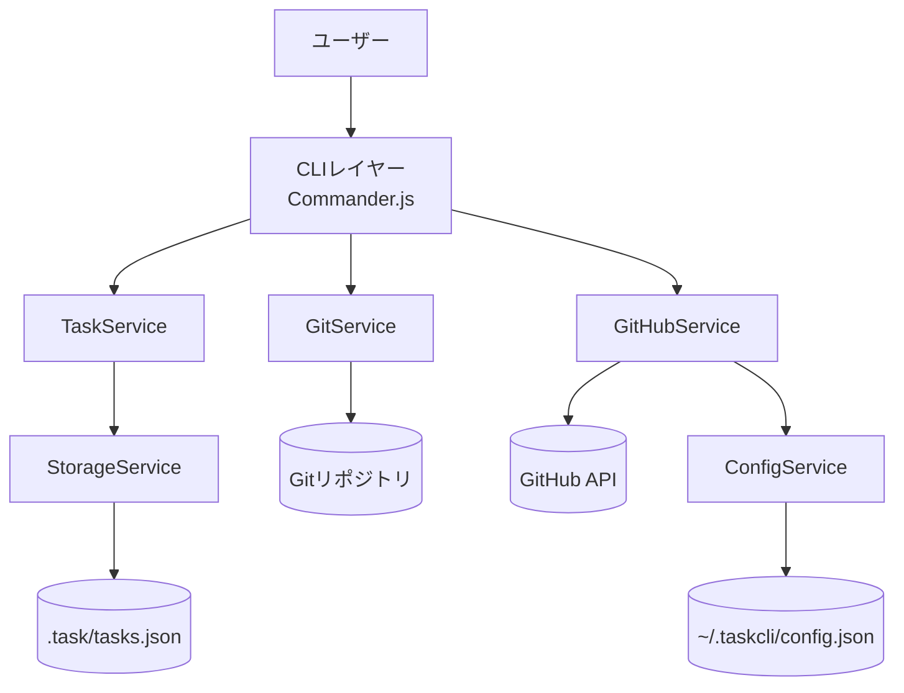

---

## 技術スタック

| 分類 | 技術 | 選定理由 |
|------|------|----------|
| 言語 | TypeScript 5.x | 型安全・IDE補完・Node.jsエコシステム |
| CLIフレームワーク | Commander.js | 学習コストが低く機能十分、広く使われている |
| Git操作 | simple-git | Node.jsからGitを安全に操作できる高水準ライブラリ |
| GitHub連携 | Octokit REST | GitHubの公式クライアントライブラリ |
| ターミナル出力 | chalk + cli-table3 | カラー出力とテーブル表示の定番ライブラリ |
| データ保存 | JSON（将来はSQLite） | MVPはシンプルなJSON、SQLite移行パスを設計上確保 |
| テスト | Vitest | TypeScriptと相性が良く高速 |
| ランタイム | Node.js v18以上（開発環境: v24.x） | LTS版、広く普及 |

---

## データモデル定義

### エンティティ: Task

```typescript
interface Task {
  id: string;              // UUID v4（採番時に自動生成）
  title: string;           // 1-200文字
  description?: string;    // オプション。Markdown形式
  status: TaskStatus;      // タスクの進捗状態
  priority: TaskPriority;  // ユーザーが設定する優先度
  dueDate?: string;        // ISO 8601形式 (YYYY-MM-DD)
  branch?: string;         // 紐付くGitブランチ名
  githubIssueNumber?: number; // 連携するGitHub Issue番号
  createdAt: string;       // ISO 8601形式
  updatedAt: string;       // ISO 8601形式
}

type TaskStatus = 'open' | 'in_progress' | 'completed' | 'archived';
type TaskPriority = 'high' | 'medium' | 'low';
```

**制約**:
- `id` は作成時に自動採番され変更不可
- `title` は空文字不可、200文字以内
- `status` の初期値は `open`
- `priority` の初期値は `medium`

### エンティティ: Config

```typescript
interface Config {
  github?: {
    token: string;         // Personal Access Token（暗号化保存）
    owner: string;         // GitHubユーザー名またはOrg名
    repo: string;          // リポジトリ名
  };
  git?: {
    defaultBranchPrefix: string; // ブランチ命名プレフィックス（デフォルト: "feature"）
  };
}
```

### エンティティ: TaskStore（JSONファイルのルート構造）

```typescript
interface TaskStore {
  version: string;    // データフォーマットバージョン（例: "1.0"）
  tasks: Task[];
}
```

### ER図

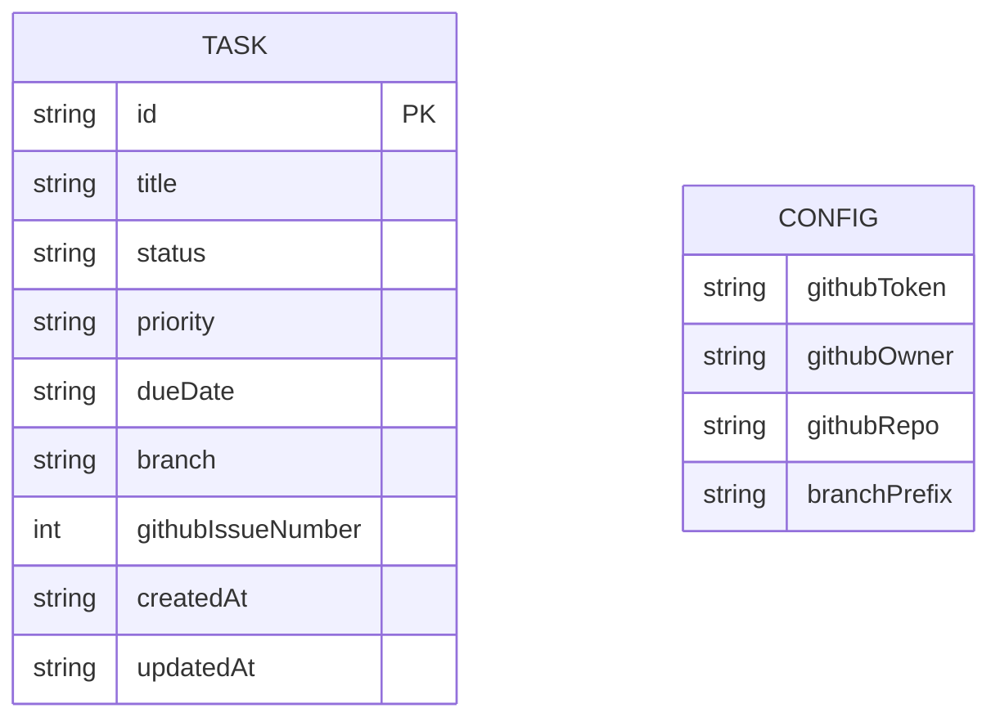

---

## コンポーネント設計

### CLIレイヤー (`src/cli/`)

**責務**: ユーザー入力の受付、バリデーション、結果表示、エラー表示

```typescript
class CLI {
  register(program: Command): void;     // コマンドをCommanderに登録
  displayTable(tasks: Task[]): void;    // テーブル形式でタスク一覧を表示
  displayTask(task: Task): void;        // タスク詳細を表示
  displaySuccess(message: string): void;
  displayError(message: string): void;
}
```

**依存関係**: Commander.js, chalk, cli-table3, TaskService, GitService, GitHubService

### TaskService (`src/services/TaskService.ts`)

**責務**: タスクCRUDのビジネスロジック

```typescript
class TaskService {
  createTask(data: CreateTaskInput): Task;
  listTasks(filter?: TaskFilter): Task[];
  getTask(id: string): Task;
  updateTask(id: string, data: UpdateTaskInput): Task;
  deleteTask(id: string): void;
  startTask(id: string): Task;         // statusをin_progressに変更
  completeTask(id: string): Task;      // statusをcompletedに変更
  archiveTask(id: string): Task;
  reopenTask(id: string): Task;        // statusをopenに戻す（P2）
  searchTasks(keyword: string): Task[];
}

interface CreateTaskInput {
  title: string;
  priority?: TaskPriority;
  dueDate?: string;
  description?: string;
}

interface TaskFilter {
  status?: TaskStatus;
  sortBy?: 'priority' | 'createdAt' | 'dueDate';
}
```

**依存関係**: StorageService

### GitService (`src/services/GitService.ts`)

**責務**: Gitブランチ操作の自動化

```typescript
class GitService {
  isGitRepo(): Promise<boolean>;
  createAndCheckoutBranch(branchName: string): Promise<void>;
  checkoutBranch(branchName: string): Promise<void>;
  branchExists(branchName: string): Promise<boolean>;
  getCurrentBranch(): Promise<string>;
  toBranchName(taskId: string, title: string, prefix: string): string;
}
```

**依存関係**: simple-git

### GitHubService (`src/services/GitHubService.ts`)

**責務**: GitHub API（Issues・PR）との連携

```typescript
class GitHubService {
  importIssues(): Promise<Task[]>;
  // 双方向同期: ローカルタスクとGitHub Issuesを同期する
  // 同期対象フィールド: title, status（open↔open, completed↔closed）, githubIssueNumber
  // 競合ルール: updatedAt が新しい方を正とする（GitHub側は updated_at で判定）
  // ローカルのみのタスク（githubIssueNumber未設定）: 同期スキップ
  // GitHubのみのIssue: importIssues() と同様に新規Taskとして追加
  syncIssues(tasks: Task[]): Promise<void>;
  createPullRequest(task: Task, branchName: string): Promise<string>; // PR URLを返す
}
```

**GitHub Issue → Task フィールドマッピング**:

| GitHub Issue フィールド | Task フィールド | 備考 |
|----------------------|--------------|------|
| `title` | `title` | そのままコピー |
| `number` | `githubIssueNumber` | Issue番号を保存 |
| `state: "open"` | `status: "open"` | |
| `state: "closed"` | `status: "completed"` | |
| `body` | `description` | Markdown形式 |
| （なし） | `priority` | デフォルト `"medium"` |

**依存関係**: @octokit/rest, ConfigService

### StorageService (`src/services/StorageService.ts`)

**責務**: JSONファイルへの読み書きとバックアップ

```typescript
class StorageService {
  load(): TaskStore;
  save(store: TaskStore): void;
  backup(): void;                       // .task/tasks.json.bak を作成
  exists(): boolean;
  initialize(): void;                   // 初回起動時にファイルを作成
}
```

**依存関係**: Node.js fs モジュール

### ConfigService (`src/services/ConfigService.ts`)

**責務**: 設定ファイルの読み書き

```typescript
class ConfigService {
  load(): Config;
  save(config: Config): void;
  getGithubToken(): string | undefined;
  setGithubToken(token: string): void;
}
```

**依存関係**: Node.js fs モジュール（`~/.taskcli/config.json`）

---

## ユースケース図

### UC-01: タスク追加 (`task add`)

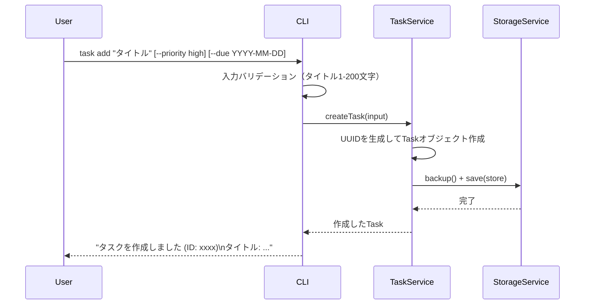

### UC-02: タスク開始とブランチ自動作成 (`task start`)

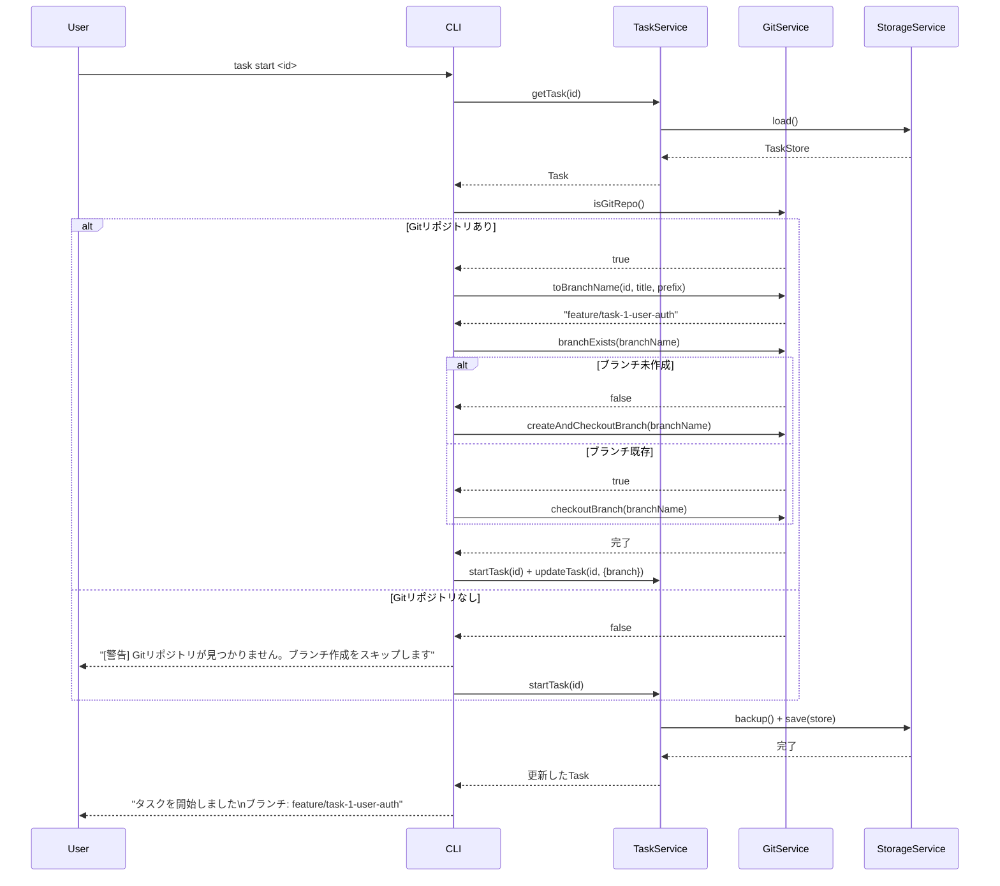

### UC-03: タスク完了 (`task done`)

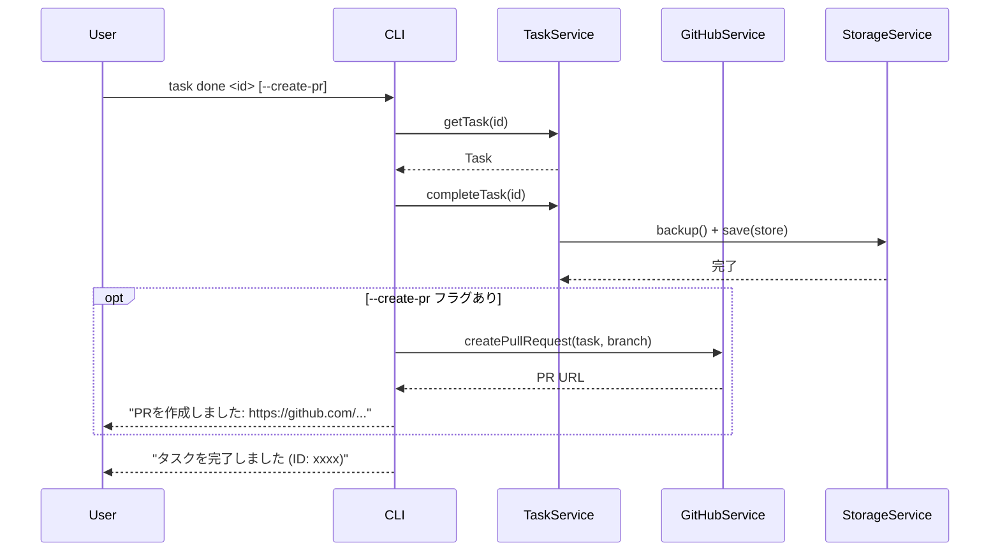

### UC-04: タスク一覧表示 (`task list`)

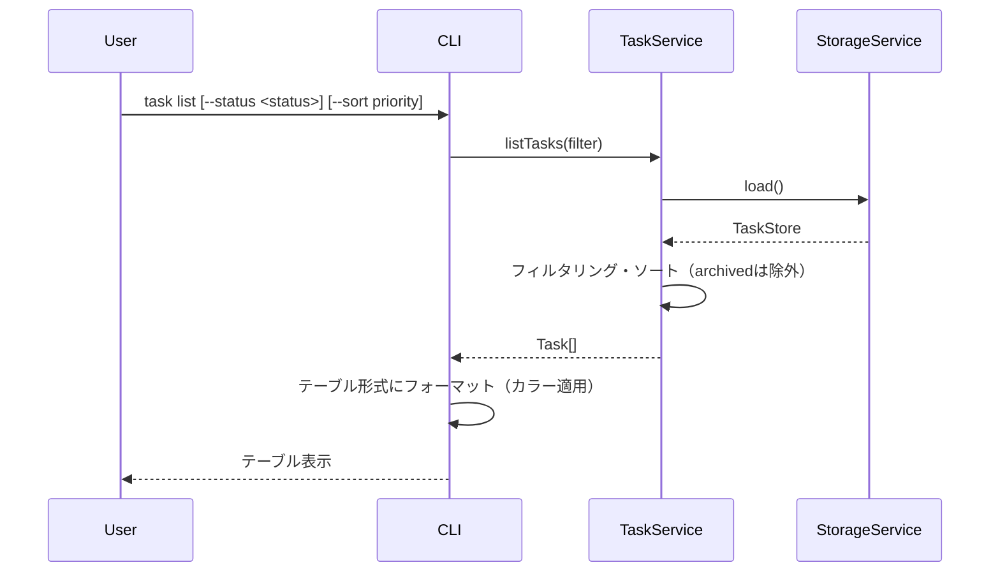

### UC-05: タスク詳細表示 (`task show`)

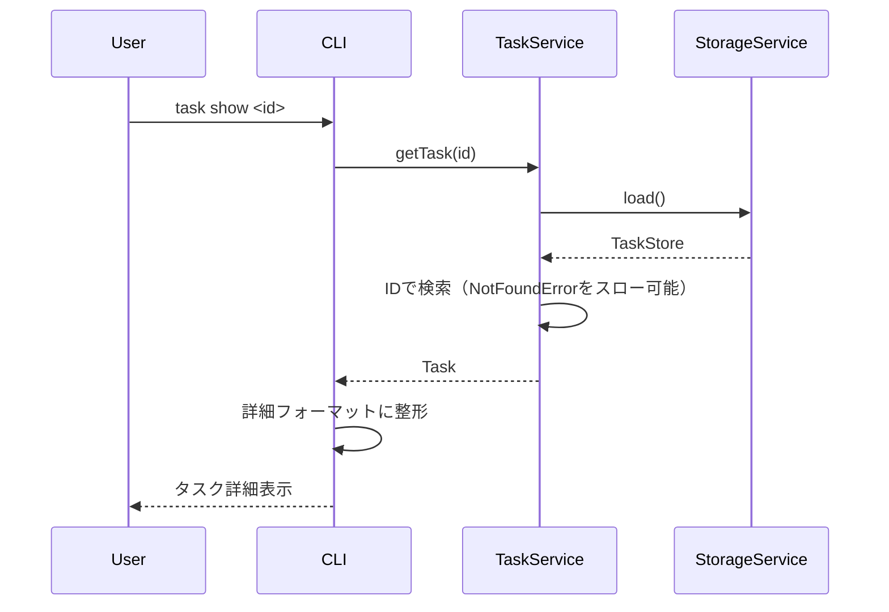

### UC-06: タスク削除 (`task delete`)

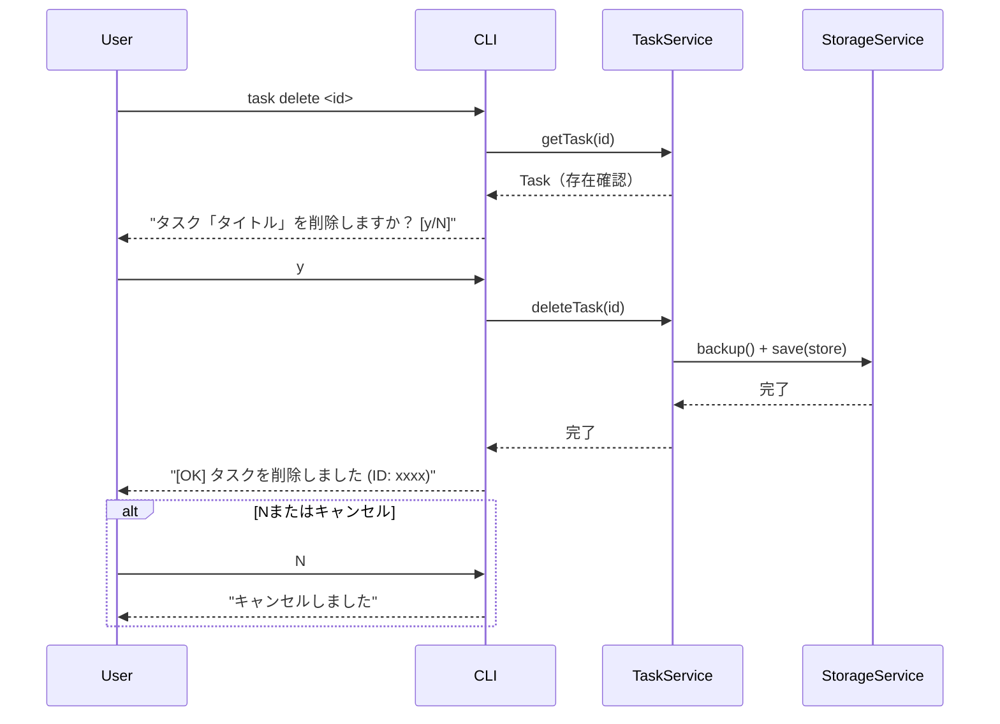

### UC-07: GitHub連携設定 (`task config`)

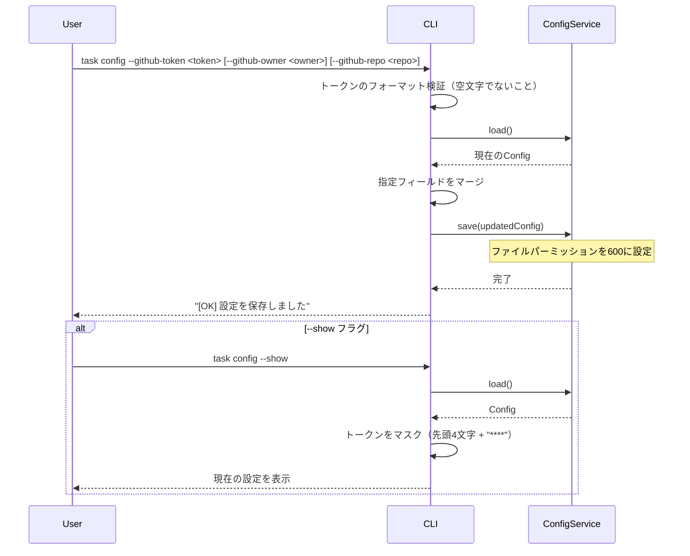

### UC-08: GitHub Issues インポート (`task import --github`)

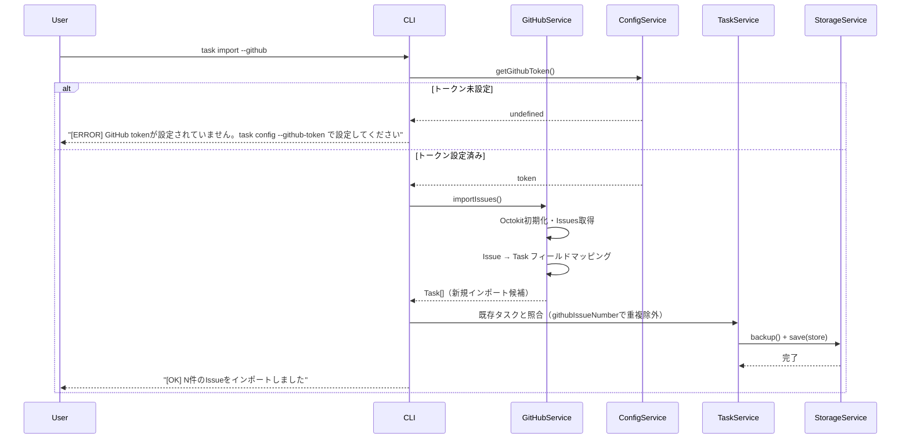

### UC-09: GitHub Issues 双方向同期 (`task sync`)

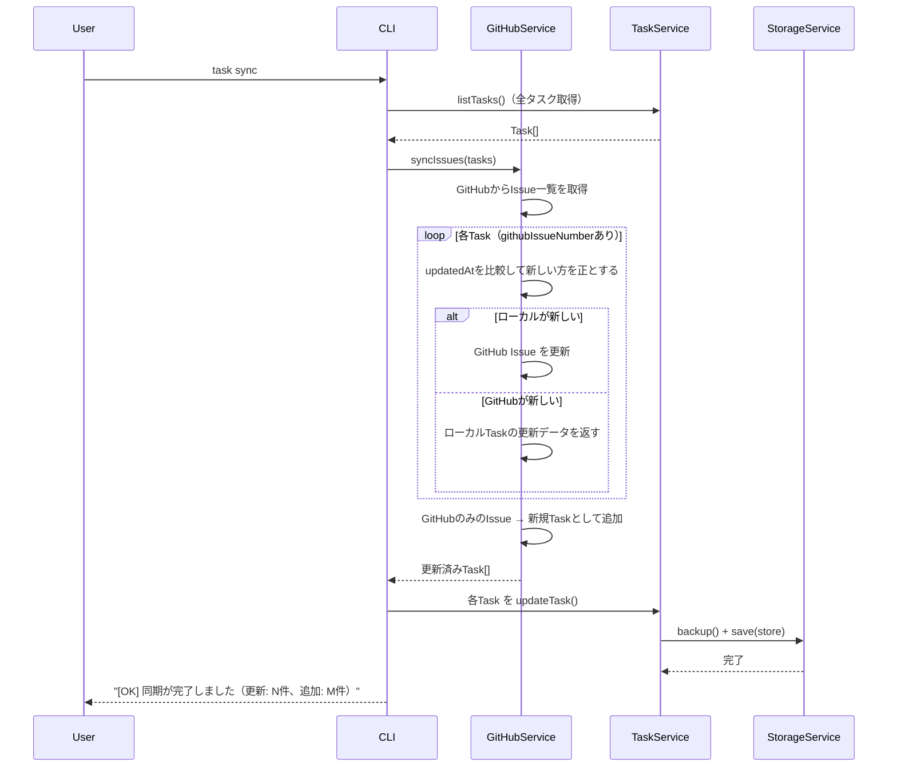

---

## タスクステータス遷移図

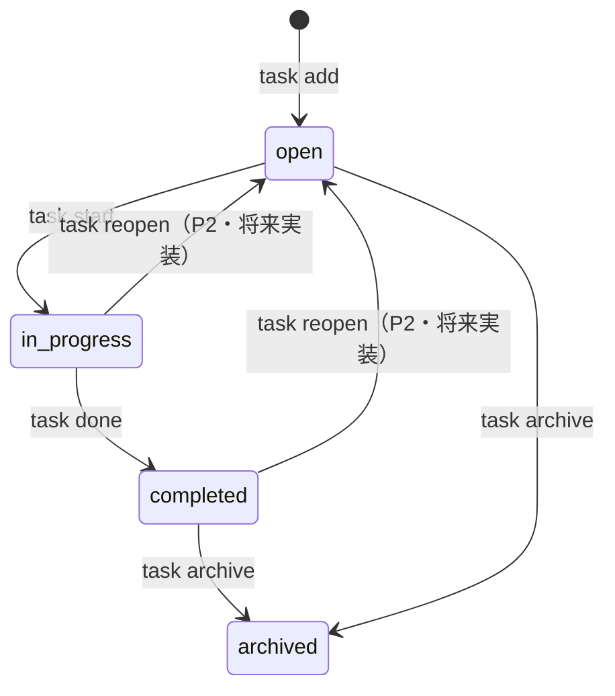

---

## UI設計

### タスク一覧テーブル

```
ID         Status       Title                              Branch
────────── ──────────── ──────────────────────────────── ─────────────────────────────────────────
a1b2c3d4   in_progress  ユーザー認証機能の実装              feature/task-a1b2c3d4-user-auth
e5f6g7h8   open         データエクスポート機能              -
i9j0k1l2   completed    初期セットアップ                   feature/task-i9j0k1l2-initial-setup
```

**表示項目**:
| 項目 | 説明 | フォーマット |
|------|------|-------------|
| ID | タスクの連番（UUID先頭8文字） | 数字 |
| Status | タスクのステータス | カラー付きテキスト |
| Title | タスクタイトル | 最大40文字（超過は省略） |
| Branch | 紐付くGitブランチ名 | `-` はブランチ未設定 |

### カラーコーディング

**ステータスの色分け**:
- `in_progress`（作業中）: 黄色
- `completed`（完了）: 緑
- `open`（未着手）: 白
- `archived`（アーカイブ）: グレー

**その他**:
- 期限当日・超過のタスク: タイトルを赤色で表示
- エラーメッセージ: 赤色プレフィックス `[ERROR]`
- 警告メッセージ: 黄色プレフィックス `[WARNING]`
- 成功メッセージ: 緑色プレフィックス `[OK]`

### タスク詳細表示 (`task show <id>`)

```
ID:          a1b2c3d4
タイトル:     ユーザー認証機能の実装
ステータス:   in_progress
優先度:       high
期限:         2025-01-20 (あと3日)
ブランチ:     feature/task-a1b2c3d4-user-auth
作成日時:     2025-01-17 10:00:00
更新日時:     2025-01-17 14:30:00
```

---

## ブランチ命名規則

`task start` 実行時のブランチ名生成ロジック:

1. タイトルを英数字・ハイフンのみに変換（日本語はslugify、スペースはハイフン）
2. 小文字化
3. 連続ハイフンを単一ハイフンに統一
4. 先頭・末尾のハイフンを除去
5. 最大50文字に切り詰め
6. `{prefix}/task-{id}-{slug}` 形式に組み立て

**例**:
- タイトル: "ユーザー認証機能の実装" → `feature/task-1-user-authentication`
- タイトル: "Fix login bug" → `feature/task-2-fix-login-bug`
- プレフィックス: Config で変更可能（デフォルト: `feature`）

---

## ファイル構造

**プロジェクト内データ保存**:
```
.task/
├── tasks.json      # タスクデータ（メイン）
└── tasks.json.bak  # 直前のバックアップ
```

**`tasks.json` の内容例**:
```json
{
  "version": "1.0",
  "tasks": [
    {
      "id": "a1b2c3d4-e5f6-7890-abcd-ef1234567890",
      "title": "ユーザー認証機能の実装",
      "status": "in_progress",
      "priority": "high",
      "dueDate": "2025-01-20",
      "branch": "feature/task-1-user-auth",
      "createdAt": "2025-01-17T10:00:00.000Z",
      "updatedAt": "2025-01-17T14:30:00.000Z"
    }
  ]
}
```

**グローバル設定**:
```
~/.taskcli/
└── config.json     # GitHub tokenなどの設定（パーミッション600）
```

**`config.json` の内容例**:
```json
{
  "github": {
    "token": "ghp_xxxxxxxxxxxx",
    "owner": "username",
    "repo": "my-project"
  },
  "git": {
    "defaultBranchPrefix": "feature"
  }
}
```

---

## パフォーマンス最適化

- **遅延ロード**: GitHub連携は `import --github` / `sync` コマンド実行時のみ初期化する（起動時間短縮）
- **ファイル読み込みキャッシュ**: 同一コマンド実行中は `tasks.json` を一度だけ読み込む
- **インクリメンタルバックアップ**: `tasks.json.bak` は前回バックアップと差分がある場合のみ上書き（差分検出はJSONを文字列化してハッシュ比較）

---

## セキュリティ考慮事項

- **トークン保護**: `~/.taskcli/config.json` のパーミッションを `600` に強制設定し、グループ・他者から読み取り不可にする
- **トークン漏洩防止**: エラーログ・標準出力にGitHub Tokenを一切出力しない
- **コマンドインジェクション対策**: タスクタイトルをシェルコマンドに直接渡さず、`simple-git` のAPIのみ使用する
- **入力バリデーション**: タイトル（1-200文字）・期限日（ISO 8601形式）を受け入れ前に検証する

---

## エラーハンドリング

### エラーの分類

| エラー種別 | 処理 | ユーザーへの表示 |
|-----------|------|-----------------|
| 入力バリデーションエラー | 処理を中断 | `[ERROR] タイトルは1〜200文字で入力してください` |
| タスクが見つからない | 処理を中断 | `[ERROR] タスクが見つかりません (ID: xxxx)` |
| データファイル読み込み失敗 | 空データで初期化して継続 | `[WARNING] データファイルが見つかりません。新規作成します` |
| Gitリポジトリが存在しない | ブランチ作成をスキップし処理継続 | `[WARNING] Gitリポジトリが見つかりません。ブランチ作成をスキップします` |
| Gitコマンド失敗 | タスクのステータス変更をロールバック | `[ERROR] ブランチ作成に失敗しました: <詳細>` |
| GitHub API認証エラー | 処理を中断 | `[ERROR] GitHubの認証に失敗しました。task config --github-token で設定してください` |
| GitHub APIレート制限 | 処理を中断 | `[ERROR] GitHub APIのレート制限に達しました。しばらく待ってから再試行してください` |
| 削除時の確認拒否 | 処理をキャンセル | `キャンセルしました` |

---

## テスト戦略

**カバレッジ目標**: サービスレイヤー（`src/services/`）80%以上、CLIレイヤー（`src/cli/`）60%以上（[architecture.md](./architecture.md) 参照）

### ユニットテスト（Vitest）

- `TaskService`: 各メソッドの正常系・異常系（タスク未発見、バリデーションエラー、無効なステータス遷移）
- `GitService.toBranchName`: 各種タイトルからのブランチ名生成（日本語・特殊文字・長文字列）
- `StorageService`: 読み込み・書き込み・バックアップ・初期化、差分なし時のバックアップスキップ
- `ConfigService`: トークン保存・読み込み・マスク表示

### 統合テスト

- `task add` → `task list` でタスクが表示される（実際のファイルI/Oを使用、一時ディレクトリで実施）
- `task start` → Gitブランチが作成されステータスが更新される（Gitリポジトリあり環境）
- `task start` → Gitなし環境でもステータスだけ更新される

### E2Eテスト

- MVPの主要フロー: `task add` → `task start` → `task done` の一連の流れ
- GitHub連携フロー: `task config` → `task import --github` → `task sync`（GitHub APIはモック）
- エラーケース: 存在しないIDへの操作、バリデーションエラー、未認証でのGitHub操作
