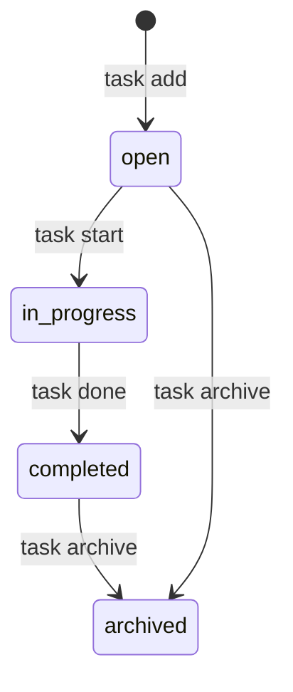

# プロジェクト用語集 (Glossary)

## 概要

このドキュメントは、TaskCLI プロジェクト内で使用される用語の定義を管理します。

**更新日**: 2026-04-29

---

## ドメイン用語

### タスク (Task)

**定義**: ユーザーが完了すべき作業の単位。

**説明**: TaskCLI における管理の基本単位。タイトル・ステータス・優先度・期限・紐付くGitブランチなどの属性を持つ。タスクは `task add` コマンドで作成され、`open` ステータスから始まる。

**関連用語**: [タスクステータス](#タスクステータス-task-status)、[タスクID](#タスクid-task-id)、[ブランチ連携](#ブランチ連携-branch-integration)

**使用例**:
- 「タスクを追加する」: `task add "ユーザー認証機能の実装"` でタスクを新規登録する
- 「タスクを開始する」: `task start 1` でステータスを `in_progress` に変更しGitブランチを作成する
- 「タスクを完了する」: `task done 1` でステータスを `completed` に変更する

**英語表記**: Task

**データモデル**: `src/types/Task.ts`

---

### タスクステータス (Task Status)

**定義**: タスクの進行状態を示す4段階の値。

**取りうる値**:

| ステータス | 意味 | 遷移条件 | 次の状態 |
|----------|------|---------|---------|
| `open` | 未着手 | タスク作成時の初期状態 | `in_progress`、`archived` |
| `in_progress` | 作業中 | `task start <id>` を実行 | `completed` |
| `completed` | 完了 | `task done <id>` を実行 | `archived` |
| `archived` | アーカイブ | `task archive <id>` を実行 | （終端） |

**状態遷移図**:



**ビジネスルール**:
- `open` → `completed` への直接遷移は禁止（`task start` を経由する必要がある）
- `archived` 状態のタスクはそれ以上のステータス変更は行わない
- `task list` はデフォルトで `archived` を除外して表示する

**英語表記**: Task Status

---

### タスクID (Task ID)

**定義**: タスクを一意に識別するUUID v4 形式の識別子。

**説明**: `task add` 実行時に自動生成される。コマンドで参照する際は先頭8文字を使用可能。リスト表示では先頭8文字を表示する。

**使用例**:
- `task show a1b2c3d4` — IDの先頭8文字でタスクを指定

**英語表記**: Task ID

---

### 優先度 (Priority)

**定義**: タスクの重要度を示す3段階の指標。

**取りうる値**:

| 値 | 意味 | 判断基準 |
|----|------|---------|
| `high` | 高 | 緊急かつ重要。期限が近い、または他の作業をブロックしている |
| `medium` | 中 | 重要だが緊急ではない（デフォルト値） |
| `low` | 低 | 重要度・緊急度ともに低い。時間があれば対応 |

**使用例**:
```bash
task add "セキュリティ脆弱性の修正" --priority high
task list --sort priority
```

**英語表記**: Priority

---

### ブランチ連携 (Branch Integration)

**定義**: タスクとGitブランチを1対1で紐付け、タスク開始時にブランチを自動作成・チェックアウトする機能。

**説明**: `task start <id>` を実行すると、`{prefix}/task-{id}-{slug}` 形式のGitブランチが自動作成される。ブランチ名はタスクタイトルを英数字・ハイフンに正規化したもの（slug）を使用する。

**ブランチ命名規則**:
- 形式: `feature/task-{id}-{title-slug}`
- 例: タイトル「ユーザー認証機能の実装」→ `feature/task-1-user-authentication`
- プレフィックス（`feature`）は設定で変更可能

**関連用語**: [スラッグ](#スラッグ-slug)

**英語表記**: Branch Integration

---

### スラッグ (Slug)

**定義**: タスクタイトルをGitブランチ名として使用できる形式に正規化した文字列。

**変換ルール**:
1. 日本語・特殊文字を対応する英語または省略形に変換
2. スペースと記号をハイフンに置換
3. 小文字化
4. 連続ハイフンを単一ハイフンに統一
5. 先頭・末尾のハイフンを除去
6. 最大50文字に切り詰め

**使用例**:
- `"ユーザー認証機能の実装"` → `user-authentication`
- `"Fix login bug"` → `fix-login-bug`

**英語表記**: Slug

---

### コンテキストスイッチ (Context Switch)

**定義**: 開発中にターミナルからGUIツール（ブラウザ、Trelloなど）へ切り替えること。

**説明**: コンテキストスイッチは集中力を途切れさせ、開発効率を低下させる。TaskCLI はこのコンテキストスイッチを排除し、ターミナル内でタスク管理を完結させることを目的とする。

**英語表記**: Context Switch

---

### ステアリングファイル (Steering File)

**定義**: 特定の開発作業のために作成する一時的なドキュメントセット。

**説明**: `.steering/[YYYYMMDD]-[タスク名]/` ディレクトリに配置される。`requirements.md`（要求内容）・`design.md`（実装アプローチ）・`tasklist.md`（進捗管理）の3ファイルで構成される。

**関連用語**: [永続ドキュメント](#永続ドキュメント-persistent-document)

**ディレクトリ構造**:
```
.steering/
└── 20250115-add-task-priority/
    ├── requirements.md
    ├── design.md
    └── tasklist.md
```

**英語表記**: Steering File

---

### 永続ドキュメント (Persistent Document)

**定義**: プロジェクト全体を通じて保持される設計・仕様ドキュメント。

**説明**: `docs/` ディレクトリに配置される。PRD・機能設計書・アーキテクチャ設計書・リポジトリ構造・開発ガイドライン・用語集の6種類。ステアリングファイルと異なり、削除せず継続的に更新する。

**関連用語**: [ステアリングファイル](#ステアリングファイル-steering-file)

**英語表記**: Persistent Document

---

## 技術用語

### Commander.js

**定義**: Node.js 向けのCLIフレームワーク。コマンドの定義・引数パース・ヘルプ生成を担う。

**本プロジェクトでの用途**: `src/index.ts` でルートプログラムを作成し、各コマンドを登録する。

**バージョン**: ^12.0.0

**選定理由**: 学習コストが低く機能十分。Node.js CLI の定番ライブラリ。

**関連ドキュメント**: [アーキテクチャ設計書](./architecture.md)

---

### simple-git

**定義**: Node.js からGitを操作するための高水準ラッパーライブラリ。

**本プロジェクトでの用途**: `GitService` でブランチ作成・チェックアウト・リポジトリ存在確認に使用する。

**バージョン**: ^3.0.0

**選定理由**: シェルインジェクションのリスクなく安全にGit操作できる。生のシェルコマンド実行より安全。

**設定ファイル**: `src/services/GitService.ts`

---

### Octokit

**定義**: GitHub REST API の公式 Node.js クライアントライブラリ。

**本プロジェクトでの用途**: `GitHubService` でGitHub Issues のインポート・同期・PR作成に使用する。

**バージョン**: `@octokit/rest` ^21.0.0

**関連ドキュメント**: [機能設計書 GitHubService](./functional-design.md)

---

### Vitest

**定義**: Vite ベースの高速なTypeScript対応テストフレームワーク。

**本プロジェクトでの用途**: ユニットテスト・統合テスト・E2Eテストの実行。カバレッジ計測（`@vitest/coverage-v8`）も使用。

**バージョン**: ^2.0.0

**選定理由**: TypeScript と ESM をネイティブサポートし、設定が最小限で済む。既存の `package.json` に含まれていた。

**設定ファイル**: `vitest.config.ts`

---

### Husky

**定義**: Gitフックを簡単に設定するためのツール。コミット前に自動でコマンドを実行する。

**本プロジェクトでの用途**: `pre-commit` フックで `lint-staged`（ESLint + Prettier）を実行し、品質を保つ。

**バージョン**: ^9.0.0

**設定ファイル**: `.husky/pre-commit`

---

## 略語・頭字語

### CLI

**正式名称**: Command Line Interface

**意味**: コマンドラインから文字入力で操作するインターフェース。

**本プロジェクトでの使用**: TaskCLI のメインインターフェース。ユーザーは `task add "タスク"` のようなコマンドでタスクを操作する。

**実装**: `src/cli/` ディレクトリ

---

### CRUD

**正式名称**: Create, Read, Update, Delete

**意味**: データの基本操作4種（作成・読み取り・更新・削除）。

**本プロジェクトでの使用**: タスクの基本操作（`task add`・`task show`・`task done`・`task delete`）を指す場面で使用する。

---

### MVP

**正式名称**: Minimum Viable Product

**意味**: 最小限の機能で成立するプロダクト。

**本プロジェクトでの使用**: P0 優先度の機能（タスクCRUD・ステータス管理・ブランチ連携・一覧表示）を指す。

---

### PAT

**正式名称**: Personal Access Token

**意味**: GitHubへのアクセス権限を持つ個人用トークン。

**本プロジェクトでの使用**: `GitHubService` がGitHub APIを呼び出す際の認証に使用。`~/.taskcli/config.json` に保存（パーミッション 600）。

---

### PRD

**正式名称**: Product Requirements Document

**意味**: プロダクト要求定義書。プロダクトの目的・ターゲットユーザー・機能要件・非機能要件を定義する文書。

**本プロジェクトでの使用**: `docs/product-requirements.md`

---

### UUID

**正式名称**: Universally Unique Identifier

**意味**: グローバルに一意な識別子。Version 4はランダム生成。

**本プロジェクトでの使用**: タスクIDの生成に使用（`uuid` ライブラリの `randomUUID()`）。

---

## アーキテクチャ用語

### レイヤードアーキテクチャ (Layered Architecture)

**定義**: システムを役割ごとに複数の層（レイヤー）に分割し、上位層から下位層への一方向の依存関係を持たせる設計パターン。

**本プロジェクトでの適用**: 3層構造を採用している。

```
CLIレイヤー (src/cli/)       ← ユーザー入力・表示
    ↓
サービスレイヤー (src/services/)  ← ビジネスロジック
    ↓
データレイヤー (StorageService)   ← ファイルI/O
```

**メリット**: 関心の分離・各レイヤーを独立してテスト可能・変更の影響範囲が限定的

**依存関係のルール**:
- ✅ CLIレイヤー → サービスレイヤー
- ✅ サービスレイヤー → データレイヤー
- ❌ サービスレイヤー → CLIレイヤー（禁止）
- ❌ CLIレイヤー → データレイヤーの直接アクセス（禁止）

**関連ドキュメント**: [アーキテクチャ設計書](./architecture.md)、[リポジトリ構造定義書](./repository-structure.md)

---

### サービスレイヤー (Service Layer)

**定義**: ビジネスロジックを担うレイヤー。CLIレイヤーからの呼び出しを受け、データレイヤーを使ってデータを操作する。

**本プロジェクトでの実装**:
- `TaskService`: タスクCRUD
- `GitService`: Gitブランチ操作
- `GitHubService`: GitHub API連携
- `StorageService`: JSONファイル永続化
- `ConfigService`: 設定ファイル管理

**英語表記**: Service Layer

---

### TaskStore

**定義**: タスクデータを永続化するJSONファイル（`.task/tasks.json`）のルートデータ構造。

**説明**: `version`（データフォーマットバージョン）と `tasks`（タスク配列）を持つ。将来のSQLiteへの移行時にフォーマットバージョンで判定できるよう設計されている。

```typescript
interface TaskStore {
  version: string;  // "1.0"
  tasks: Task[];
}
```

**英語表記**: TaskStore

---

## エラー・例外

### ValidationError

**クラス名**: `ValidationError`

**継承元**: `Error`

**発生条件**: ユーザーの入力がバリデーションに違反した場合（タイトルが空・200文字超、期限日の形式不正など）。

**エラーメッセージフォーマット**: `[フィールド名] の値が不正です: [詳細]`

**対処方法**:
- ユーザー: エラーメッセージに従って入力を修正する
- 開発者: `field` プロパティを参照して違反したフィールドを特定する

**実装箇所**: `src/types/errors.ts`

**使用例**:
```typescript
throw new ValidationError(
  'タイトルは1〜200文字で入力してください（現在: 250文字）',
  'title',
  title
);
```

---

### NotFoundError

**クラス名**: `NotFoundError`

**継承元**: `Error`

**発生条件**: 指定されたIDのタスクが `.task/tasks.json` に存在しない場合。

**エラーメッセージフォーマット**: `タスクが見つかりません (ID: {id})`

**対処方法**:
- ユーザー: `task list` で正しいタスクIDを確認する
- 開発者: IDの渡し方とストレージの整合性を確認する

**実装箇所**: `src/types/errors.ts`

---

### GitError

**クラス名**: `GitError`

**継承元**: `Error`

**発生条件**: Gitコマンドの実行に失敗した場合（ブランチ作成失敗、チェックアウト失敗など）。

**対処方法**:
- ユーザー: エラーメッセージの詳細を確認し、Gitリポジトリの状態（コンフリクト・権限など）を確認する
- 開発者: `cause` プロパティで元のエラーを参照する。タスクのステータス変更をロールバックする

**実装箇所**: `src/types/errors.ts`

---

## 索引

### あ行
- [アーカイブ（タスクステータス）](#タスクステータス-task-status)

### か行
- [コンテキストスイッチ](#コンテキストスイッチ-context-switch)

### さ行
- [サービスレイヤー](#サービスレイヤー-service-layer)
- [スラッグ](#スラッグ-slug)
- [ステアリングファイル](#ステアリングファイル-steering-file)

### た行
- [タスク](#タスク-task)
- [タスクID](#タスクid-task-id)
- [タスクステータス](#タスクステータス-task-status)
- [TaskStore](#taskstore)

### な行
- [NotFoundError](#notfounderror)

### は行
- [ブランチ連携](#ブランチ連携-branch-integration)

### ま行
- [MVP](#mvp)

### や行
- [優先度](#優先度-priority)

### ら行
- [レイヤードアーキテクチャ](#レイヤードアーキテクチャ-layered-architecture)

### わ行
- [永続ドキュメント](#永続ドキュメント-persistent-document)

### A-Z
- [CLI](#cli)
- [Commander.js](#commanderjs)
- [CRUD](#crud)
- [GitError](#giterror)
- [Husky](#husky)
- [Octokit](#octokit)
- [PAT](#pat)
- [PRD](#prd)
- [simple-git](#simple-git)
- [UUID](#uuid)
- [ValidationError](#validationerror)
- [Vitest](#vitest)
